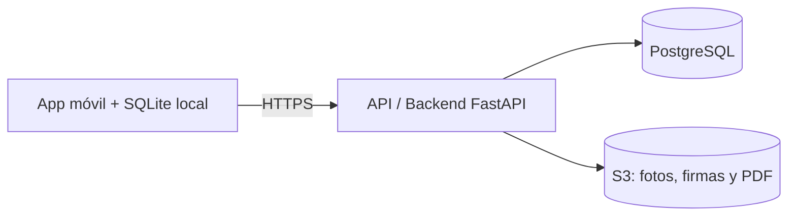

# Arquitectura — Actas de Servicio

## 1. Resumen

Sistema para que empresas de servicios técnicos (mantenimiento de aires acondicionados, fumigación, extintores, entre otros) registren en campo el trabajo realizado: checklist de tareas, fotos de evidencia y firma del cliente. Al terminar, genera un acta en PDF que no se puede alterar sin que se detecte.

La app funciona sin conexión a internet y sincroniza la información cuando vuelve la señal.

## 2. Componentes

| Componente | Tecnología | Responsabilidad |
|---|---|---|
| App móvil | React Native + Expo | Interfaz del técnico: consultar servicios, llenar el checklist, tomar fotos y capturar la firma. |
| Base de datos local | SQLite (cifrada) | Guardar en el celular las actas pendientes cuando no hay señal. |
| API y backend | FastAPI (Python) | Única puerta de entrada al sistema: autentica, autoriza, valida los datos y ejecuta la lógica. |
| Base de datos | PostgreSQL | Guardar clientes, técnicos, servicios, tareas y actas. |
| Almacenamiento de archivos | AWS S3 | Guardar fotos, firmas y PDF, que pesan demasiado para la base de datos. |

## 3. Flujo principal: ver los servicios del día

1. El técnico abre la app y se autentica con biometría o PIN.
2. La app le pide a la API los servicios del técnico para hoy.
3. El backend verifica la identidad del técnico y que solo pida sus propios servicios.
4. El backend consulta la base de datos filtrando por `tecnico_id` y `fecha = hoy`, y une cada servicio con su cliente (JOIN) para traer el nombre y la dirección.
5. La API devuelve la lista ordenada por hora, y la app la guarda también en SQLite para poder consultarla sin señal.

## 4. Flujo de sincronización sin señal

Cada acta terminada entra a una **cola de envío** en el celular y se envía en la primera oportunidad con señal, sin esperar al final del día.

1. **Primero se envían los datos del acta** (checklist, observaciones, firma, hora y ubicación): pesan poco y son la prueba legal del servicio.
2. **Después se envían las fotos, una por una**, para que las que ya llegaron queden a salvo si se corta la señal.
3. **Cada foto se sube por partes (subida reanudable):** si la señal se corta a mitad, continúa desde donde quedó.
4. **Un elemento solo sale de la cola cuando el servidor confirma que lo recibió.** Si falla, se reintenta después.
5. El administrador ve el estado real de cada acta, por ejemplo: "Acta recibida · fotos 2 de 3".

## 5. Seguridad

- La app **nunca se conecta directamente a la base de datos**. Todo pasa por el backend, que verifica quién hace la petición, qué tiene permitido ver y que los datos sean válidos.
- Toda comunicación entre la app y la API viaja cifrada por HTTPS.
- Los datos guardados en el celular están protegidos por cinco capas: cola de envío con prioridad, cifrado en reposo, llave en el chip de seguridad, bloqueo de la app y borrado remoto. Detalle en el [ADR-001](adr/ADR-001-proteccion-actas-celular.md).
- Cada acta lleva una **huella de integridad (hash)**: si alguien modifica el PDF, la huella deja de coincidir.

## 6. Modelo de datos

| Entidad | Qué representa | Relaciones |
|---|---|---|
| Cliente | Persona o empresa que recibe el servicio (identificada por NIT o cédula). | Tiene muchos servicios. |
| Técnico | Persona que realiza el servicio en campo. | Tiene muchos servicios. |
| Servicio | Orden de trabajo programada para una fecha y hora, con su estado. | Pertenece a un cliente y a un técnico. |
| Tarea | Ítem del checklist de un servicio y si se completó. | Pertenece a un servicio. |
| Foto | Evidencia de antes o después, con hora y ubicación. | Pertenece a un servicio. |
| Acta | Documento final firmado por quien recibe el servicio, con su huella de integridad. | Pertenece a un servicio (máximo una por servicio). |

El diagrama completo del modelo, con todos sus campos, está en el archivo de FigJam "Modelo de datos - Actas de servicio".

## 7. Requisitos legales

- **Ley 1581 de 2012 (protección de datos personales):** los datos de clientes y técnicos se recolectan con autorización y se protegen según el ADR-001.
- **Ley 527 de 1999 (mensajes de datos y firma electrónica):** la firma del cliente, junto con la hora, la ubicación y la huella de integridad, respalda la validez del acta.

## 8. Decisiones de arquitectura

- [ADR-001: Protección de actas guardadas en el celular](adr/ADR-001-proteccion-actas-celular.md)
- ADR-002: Stack tecnológico (pendiente)
- ADR-003: Registro de auditoría (pendiente)

## 9. Fuera del alcance del MVP

- Panel web del administrador (crear órdenes, asignar técnicos, buscar actas).
- Registro de auditoría (ADR-003).
- Notificaciones al cliente por WhatsApp.